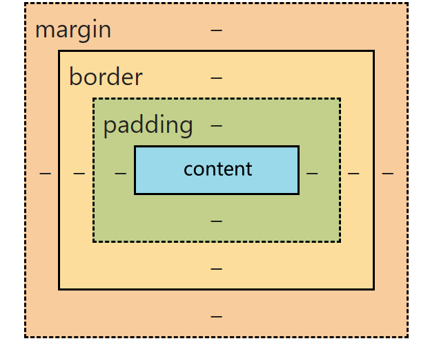

## css常用属性

## css盒子模型

content：内容  
padding：内边距  内容与边框之间的
border：文本边框  内边距的外部
margin：外边距 边框外部
从上到下以此为从内部到外部
均属于复合属性


## 浮动
### 传统的网页布局方式
- 标准流 普通流 文档流 网页按照元素的书写顺序依次排序
- 浮动
- 定位
- Flexbox和grid 自适应方式
  
本质上都是在摆盒子 把盒子摆好了布局就完成了
浮动语法：
```css
选择器{
    float:left/right/none;
}
```
浮动的三大特性
1. 脱标
2. 一行显示 顶端对齐
3. 具备行内块元素性质
Q:行内块和浮动的区别


## 定位
- 相对定位：相对于元素在文档流中的正常位置进行定位
- 绝对定位：相对于其最近的已定位的祖先元素进行定位 不占据文档流
- 固定定位 ：相对于浏览器窗口进行定位 不占据文档流 固定在屏幕中

## emmet
简写


## 复合选择器
## css三大特性
1. 继承性 子继承父亲
2. 层叠性 后面的覆盖前面的 不同的属性会叠加
3. 优先级

## 图的遍历
时间复杂度 = 访问各个顶点+访问各个边
### BFS
存储结构不同 结点的访问顺序不同
一般 邻接矩阵的话就是按照次序从小到大 
邻接表的话 主要看边是如何存储的 不确定

- 同一图的邻接矩阵表示方式唯一 因此广度优先遍历序列唯一
- 同一个图的邻接表的表示方式不唯一 因此广度优先遍历序列不唯一
```c++
bool visited[Max_Vertex_Num];


void BFS(Graph G,int v){
    visit(v);
    visited(v);
    EnQueue(Q,v);
    while(!Empty(Q)){
        DeQueue(Q,v);
        for(w=FirstNeighbor(G,v);w>=0;w=NextNeighbor(G,v,w)){
            if(!visited[w]){
                visit(w);
                visited[w]=true;
                EnQueue(Q,w);
            }
        }
    }
}

```
该代码只是解决了连通图 那么非连通图呢

```c++
void BFSTraverse(Graph G){
    for(int i = 0;i<G.vexnum;i++){
        visited[i]=false;
    }
    InitQueue(Q);
    for(int i = 0;i < G.vexnum;i++){
        if(!visited[i]) BFS(G,i);
    }
}

邻接矩阵
空间复杂度 O(|V|) 时间复杂度O(|V|2+|v|)
邻接表
O （|v|+|E|）；
```

广度优先生成树
广度优先生成森林
### DFS


```c++
bool visited[Max_Vertex_Num];


void DFS(Graph G,int v){
    visit(v);
    visited[v]=true;
    for(w=FirstNeighbor(G,v);w>=0;w=NextNeighbor(G,v,w))
    {
        if(!visited[w]){
            DFS(G,w);
        }
    }
}


同一个图的邻接矩阵表示方式唯一 因此深度优先遍历序列唯一 深度优先生成树也唯一
同一个图邻接表表示方式不唯一 因此深度优先遍历序列不唯一 深度优先生成树也不唯一
```
   