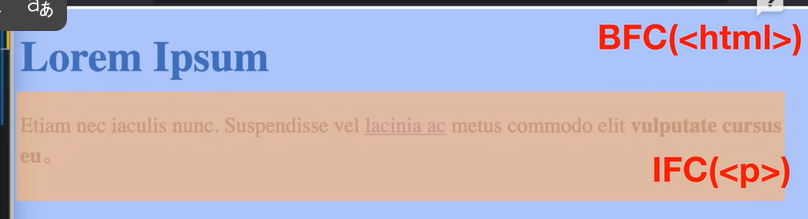
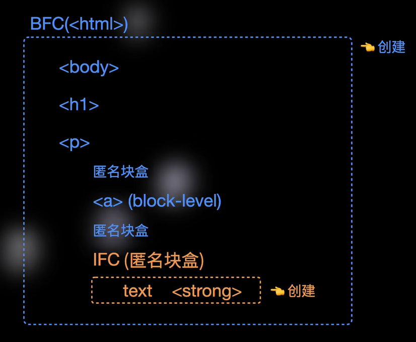
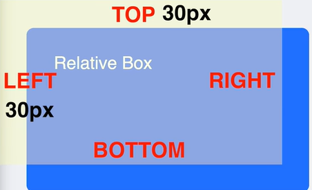
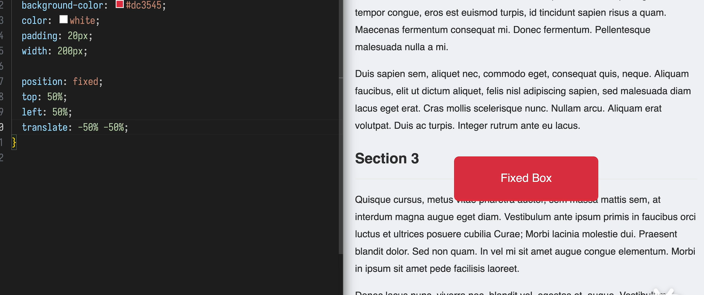
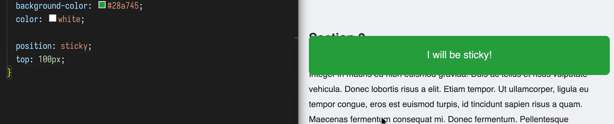
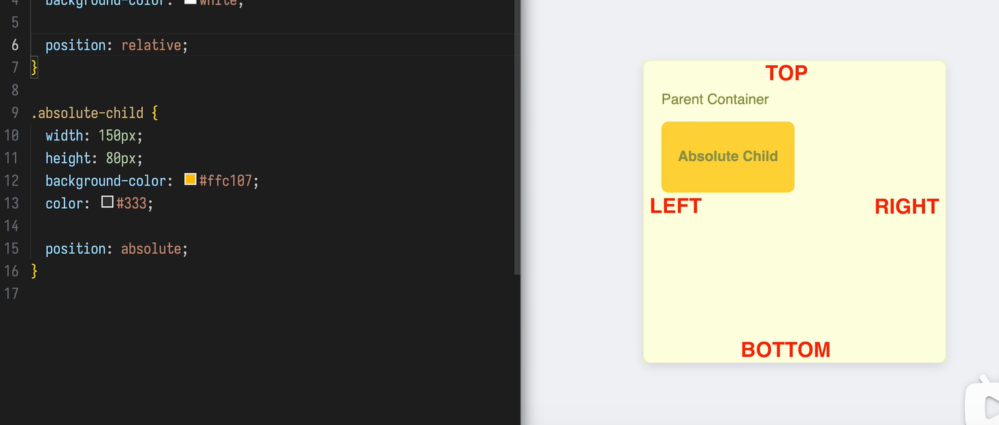
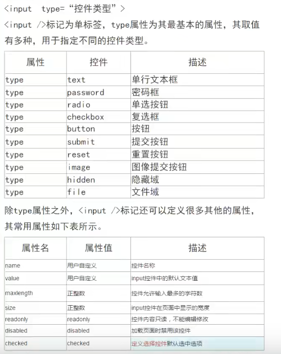

## 文档流  block-inline layout
display:block flow
block 外部显示类型 决定了元素在所处布局的环境中扮演的角色
flow 决定了元素内部的子元素按照什么方式来排列

Q：文档流的工作方式
1.块级盒子独占一行 在垂直方向上从上到下一次排列
2.行内盒子在水平方向上从左到右依次排列

Q:一个盒子内部同时存在块内盒子和行内盒子 如何共存
浏览器为其创建不同区域 分别在不同区域生效
格式化上下文
BFS 块内格式化上下文
IFS 行内格式化上下文
FFS


```
html 是建立页面的第一个元素   会建立页面的第一个BFS
body display默认值为 block flow
以块级盒子的身份参与BFS  内部的子元素按照文档流排序normal flow
h1 和 p 也是如此
```
当一个块级元素只包含行内内容的时候  它会在内部建立一个IFC

浏览器不允许行内元素和块级元素在同一层级直接混合排列
因此每个元素其实都会参与到一个格式化上下文中 但是只有满足特定条件的话 才可以创建格式化上下文



### display的两个属性
1. 外部显示类型  对外角色 block inline
2. 内部显示类型 子元素布局方式 flow flex grid

格式化上下文是一种有特殊机制的布局区域
不同的格式化上下文有不同的创建条件


文档流  BFC+IFC协同工作

外边距折叠满足一定条件
打破条件打破外边距折叠


创建新的BFC display：block flow-root
### 创建新的BFC的办法

## 盒模型深入

```txt
区块盒子 独立占据一行 可以设置宽高 内外边距会推开其他元素  块级盒子独占一行 默认占满父容器的宽度
行内元素 不会占据一行 不能设置宽高 内外边距只能在水平方向推开其他元素


为什么  css垂直方向和水平方向的行为会不同
对传统文字进行排版
纸张的宽度是有限的 但长度可以无限  横向的宽度是一个硬约束


外边距折叠问题  两个盒子margin 为20px 实际两个盒子上下排列的时候也是为20px 而不是40px
为什么外边距会发生折叠？
外边距属于盒子之外的共享空间
```
- 盒子尺寸的计算方式
```txt
box-sizing:content-box,border-box;
1. content-box 只计算内容区域
2.border-box 外边界以内
在这两种模式下 区别的是width和height的计算的起始位置不同
```


## html语义化元素

## 定位详细
### position的五个属性
- static
- relativy
- fixed 
top和left对标的是元素的左上角
要实现真正给的居中需要 translate -50% -50%
- sticky 只有到粘滞点之后才会固定
- absolute 相对于最近的设置了定位的元素进行定位  （不包含static） 如果父元素没有设置position 那么子元素会一直往上找 最终会相对于视口来设置
- z-index
  
## input
