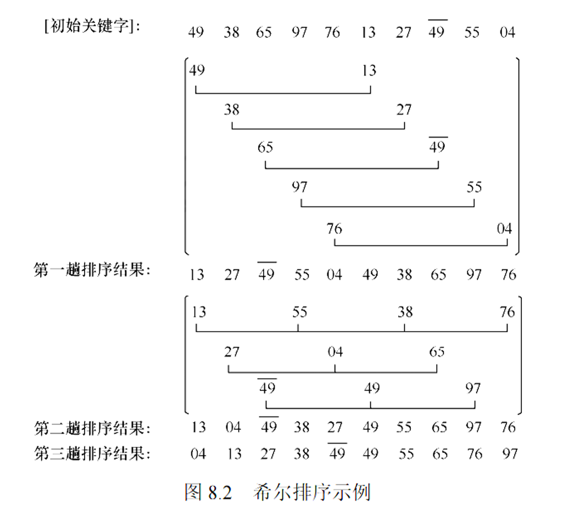

# 插入排序
基本思想：<br>
1.按照关键字大小<br>
2.插入已排序好的序的子序列
<br>
两个基本操作(当然不排除有的排序不需要这两个操作)
1. 移动
2. 比较

## 直接插入排序

先比较 然后移动 如此往复
```c++
void InsertSort(ElemType A[],int n){
    int i,j;
    for(int i= 2;i<=n;i++){
        if(A[i]<A[i-1]){
            A[0]=A[i];
            for(int j=i-1;A[0]<a[j];--j){
                A[j+1] = A[j];
            }
            A[j+1]=A[0];
        }
    }
}
```
1. 空间效率：O(1)(只占了A[0]一个辅助单元)
2. 时间效率：<br>
最好：O(n) 已经有序<br>
最坏：O(n<sup>2</sup>)<br>
平均状况下 移动平均为n<sup>2</sup>/4<br>
平均：O(n<sup>2</sup>)<br>
稳定性：稳定
适用：顺序存储 链式存储
## 折半插入排序
先比较 然后移动
当排序是顺序表的时候
```c++
void InserSort(ElemType A[],int n){
    int i,j,low,high,mid;
    for(int i = 2;i <= n;i ++){
        low = 1;high = i-1;
        while(low<=high){
            mid = (low + high)/2;
            if(A[mid]>A[0]){
                high = mid -1;
            }
            else low = mid+1;
        }

        for(j=i-1;j>=high+1;--j){
            A[j+1]=A[j];
        }
        A[high+1]=A[0];
    }
}


```
时间复杂度  
其实本质上就是减少了比较的次数  
在总的时间复杂度并没有改变O(n<sup>2</sup>)  
适用：顺序存储的线性表


## 希尔排序

步骤：  
1.先取一个小于n的增量 n<sub>1</sub> 那么就相当于分成了n<sub>1</sub>个子序列  
2.在同一组的进行直接插入排序  
3.当增量为1的时候即为最后一次

例1：
d1 = 5 d2 = 3 d3 = 1;


例2：


```c++
void ShellSort(ElemType A[],int n){
    int dk,i,j;
    //A[0]暂存单元 不是哨兵
    for(dk=n/2;dk>=1;dk=dk/2)
        for(i=dk+1;i<=n;++i){
            //注意这里的比较 这里的比较只是作为一个入口  相当于要不要开始比较 如果需要的话那么就进行下面的正式比较
            if(A[i]<A[i-dk]){
                A[0]=A[i];
                for(j=i-dk;j>0 && A[0]<A[j];j-=dk)
                    A[j+dk]=A[j];
                A[j+dk]=A[0];
            }
        }
}
```

空间效率:O(1)  
时间复杂度：约为O(n<sup>1.3</sup>) 最坏情况下O(n<sup>2</sup>)  
稳定性:不稳定  
适应性 ：顺序存储


